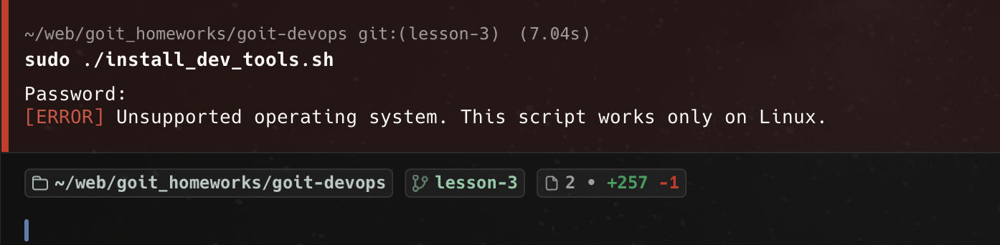
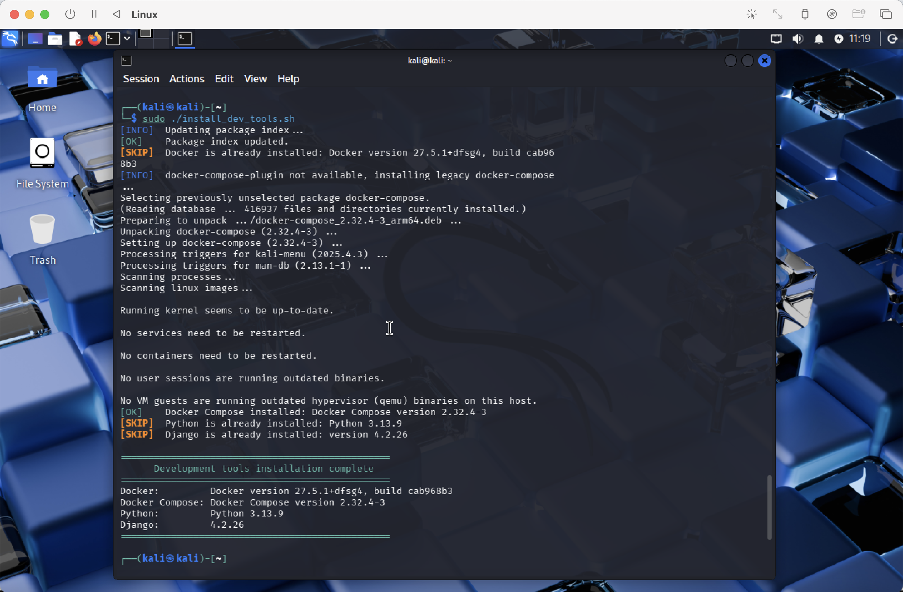

# Homework 3: Linux Administration

A Bash script for automated installation of development tools on Debian/Ubuntu-based Linux systems.

## Features
- Installs Docker and Docker Compose
- Installs Python 3.9+ with pip and venv
- Installs Django via pip
- Checks if tools are already installed to avoid duplication

## Requirements
- Linux (Debian/Ubuntu)
- `apt-get`
- Root privileges

## Usage
Make the script executable:
```bash
chmod u+x install_dev_tools.sh
```

## Run the script:
```bash
sudo ./install_dev_tools.sh
```

## Screenshots

### 1. Unsupported OS check (macOS)
The script correctly detects a non-Linux environment and exits with an appropriate error message.



---

### 2. Successful installation (Linux)
The script runs successfully on a supported Linux system, installs missing tools, and skips already installed components.

