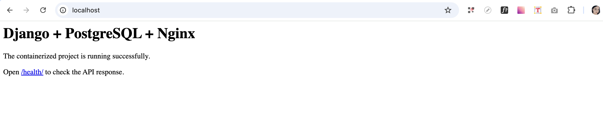
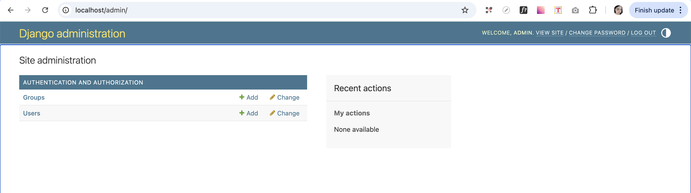
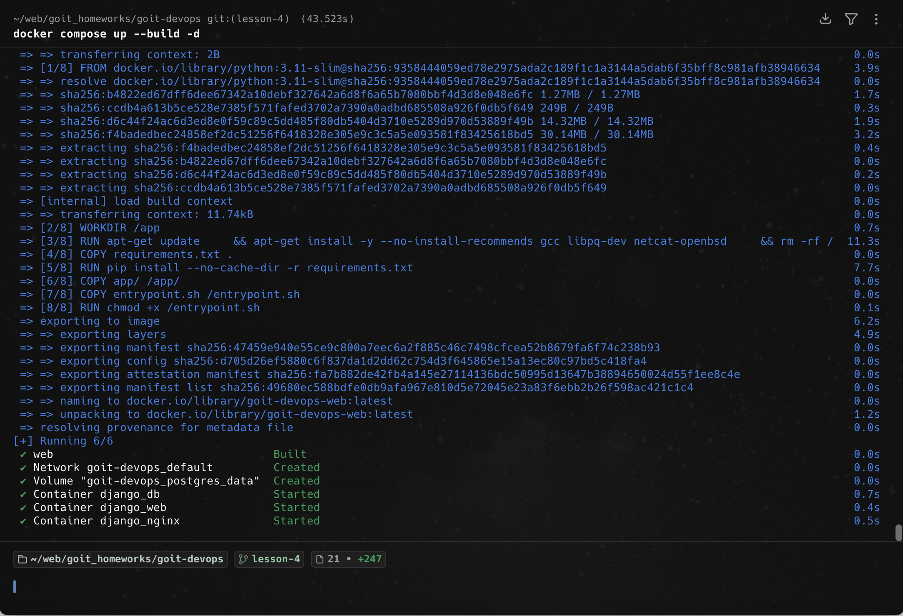
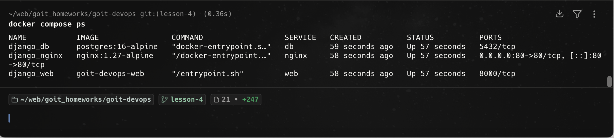

# Homework 4 — Docker

## Description

This project demonstrates containerization of a web application using Docker and Docker Compose.

The stack includes:
- **Django** — web application
- **PostgreSQL** — database
- **Nginx** — reverse proxy and static files server

All services are containerized and connected via Docker Compose.

---

## Project Structure
```
project-root/
├── app/
│   ├── core/
│   │   ├── __init__.py
│   │   ├── asgi.py
│   │   ├── settings.py
│   │   ├── urls.py
│   │   └── wsgi.py
│   ├── main/
│   │   ├── __init__.py
│   │   ├── admin.py
│   │   ├── apps.py
│   │   ├── migrations/
│   │   │   └── __init__.py
│   │   ├── models.py
│   │   ├── tests.py
│   │   └── views.py
│   └── manage.py
├── nginx/
│   └── nginx.conf
├── screenshots/
│   ├── home.png
│   ├── admin.png
│   ├── docker_build.png
│   └── docker_ps.png
├── Dockerfile
├── docker-compose.yml
├── entrypoint.sh
├── requirements.txt
├── .env.example
├── .gitignore
├── .dockerignore
└── README.md

---
```

## Services

### web (Django)
- Runs Django application
- Uses Gunicorn as WSGI server
- Connects to PostgreSQL

### db (PostgreSQL)
- Stores application data
- Uses Docker volume for persistence

### nginx
- Proxies requests to Django
- Serves static files

---

## Setup & Run

### 1. Create `.env` file

```bash
cp .env.example .env
```
### 2. Build and start containers

```bash
docker compose up --build -d
```

### 3. Open in browser
http://localhost

### 4. Create superuser

```bash
docker compose exec web python manage.py createsuperuser
```

## Useful Commands

### Stop containers

```bash
docker compose down
```

### View logs

```bash
docker compose logs -f
```

### Run migrations

```bash
docker compose exec web python manage.py migrate
```

### Collect static files

```bash
docker compose exec web python manage.py collectstatic --noinput
```

### Check running containers

```bash
docker compose ps
```

## Screenshots

### Home page


### Admin panel


### Docker build


### Running containers
