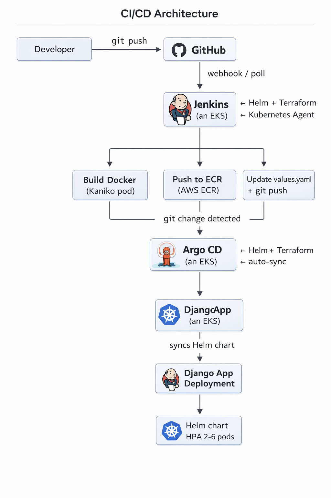
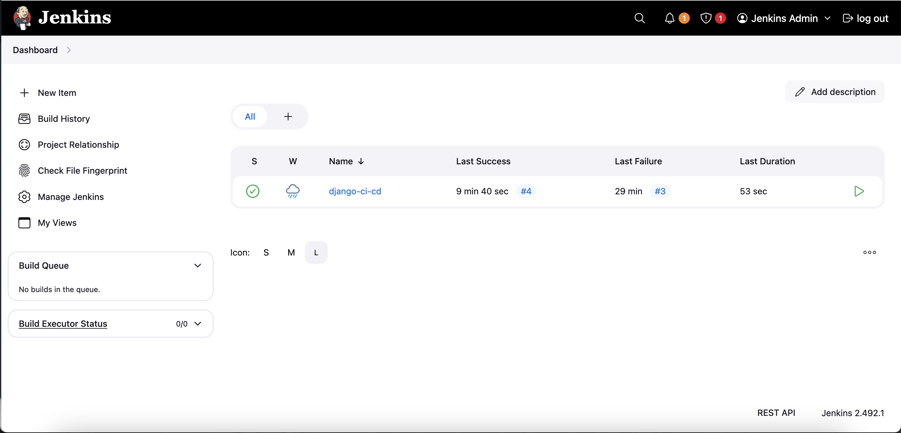
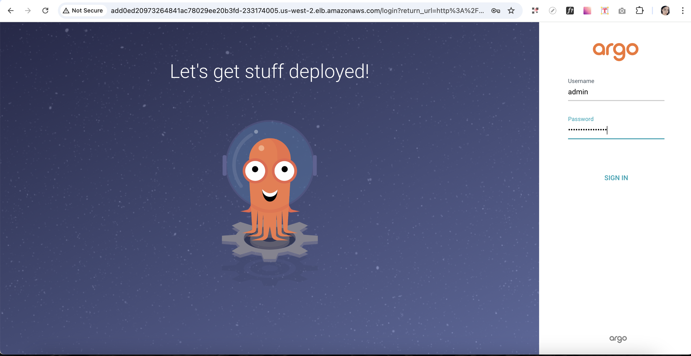
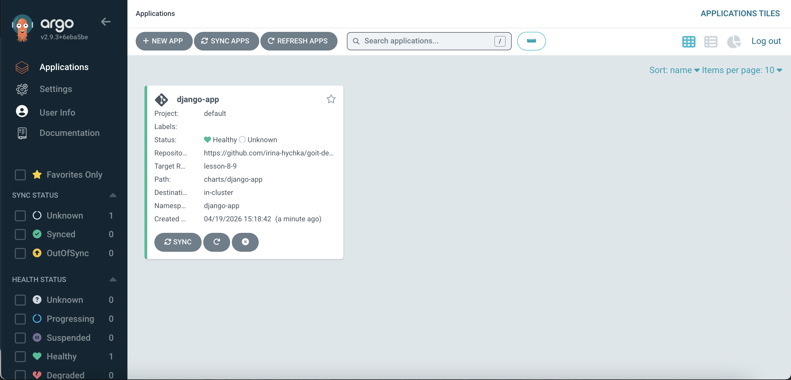
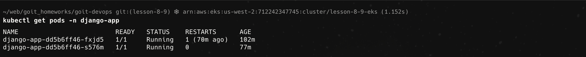
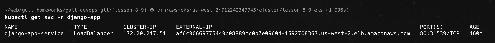
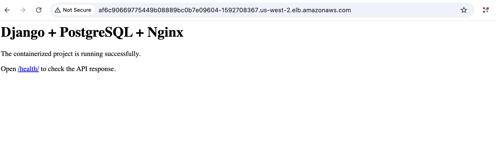
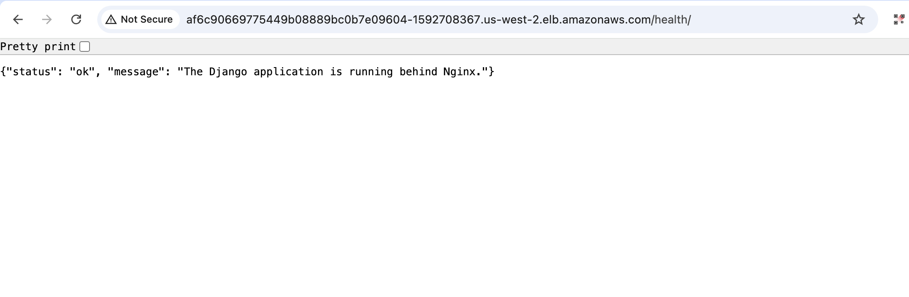

# Homework 8-9: Studying Argo CD + CD

## Overview

This project demonstrates a complete CI/CD pipeline using:

- Terraform (Infrastructure as Code)
- Amazon EKS (Kubernetes cluster)
- Amazon ECR (container registry)
- Jenkins (CI pipeline)
- Helm (application packaging)
- Argo CD (GitOps continuous delivery)

The application is a containerized Django project deployed to Kubernetes.

---

## Architecture

CI/CD flow:

1. Developer pushes code to GitHub  
2. Jenkins pipeline is triggered  
3. Jenkins:
   - builds Docker image  
   - pushes image to AWS ECR  
   - updates Helm values.yaml with new image tag  
   - pushes changes back to GitHub  
4. Argo CD:
   - detects changes in repository  
   - synchronizes Helm chart  
   - deploys updated application to Kubernetes 


 

---

## Technologies Used

- Terraform  
- AWS EKS  
- AWS ECR  
- Jenkins  
- Helm  
- Argo CD  
- Docker  
- Django  
- Kubernetes  

---

## Project Structure

```
.
├── Dockerfile
├── Jenkinsfile
├── Project
│   ├── backend.tf
│   ├── main.tf
│   ├── outputs.tf
│   ├── providers.tf
│   ├── variables.tf
│   ├── modules
│   │   ├── argo_cd
│   │   ├── ecr
│   │   ├── eks
│   │   ├── jenkins
│   │   ├── s3-backend
│   │   └── vpc
│   └── charts
│       └── django-app
│           ├── templates
│           ├── Chart.yaml
│           └── values.yaml
├── myproject
│   ├── core
│   │   ├── asgi.py
│   │   ├── settings.py
│   │   ├── urls.py
│   │   └── wsgi.py
│   ├── main
│   │   ├── admin.py
│   │   ├── models.py
│   │   └── views.py
│   └── manage.py
├── requirements.txt
└── README.md
```

---

## Implementation Steps

### Step 1 — S3 Backend

Initialize Terraform and create S3 backend resources:

```
cd lesson-8-9  
terraform init  
terraform apply -target=module.s3_backend
```

---

### Step 2 — Enable Remote Backend

Uncomment S3 backend configuration in backend.tf:

```
sed -i '' 's/# terraform {/terraform {/' backend.tf  
sed -i '' 's/#   backend "s3" {/  backend "s3" {/' backend.tf  
sed -i '' 's/#     bucket/    bucket/' backend.tf  
sed -i '' 's/#     key/    key/' backend.tf  
sed -i '' 's/#     region/    region/' backend.tf  
sed -i '' 's/#     dynamodb_table/    dynamodb_table/' backend.tf  
sed -i '' 's/#     encrypt/    encrypt/' backend.tf  
sed -i '' 's/#   }/  }/' backend.tf  
sed -i '' 's/# }/}/' backend.tf
```

Reinitialize Terraform with state migration:

```
terraform init -migrate-state
```

---

### Step 3 — Provision VPC, ECR and EKS

```
terraform apply -target=module.vpc -target=module.ecr -target=module.eks 
```

Cluster provisioning takes approximately 10–15 minutes.

Configure kubectl access:

```
aws eks update-kubeconfig --region us-west-2 --name lesson-8-9-eks
kubectl get nodes
```

---

### Step 4 — Install EBS CSI Driver

Add Helm repository and install the driver:

```
helm repo add aws-ebs-csi-driver https://kubernetes-sigs.github.io/aws-ebs-csi-driver  
helm repo update  

helm upgrade --install aws-ebs-csi-driver aws-ebs-csi-driver/aws-ebs-csi-driver \
  --namespace kube-system
```

Verify installation:

```
kubectl get pods -n kube-system | grep ebs
```

---

### Step 5 — Install Jenkins and Argo CD

Deploy Jenkins:

```
terraform apply -target=module.jenkins
```

Deploy Argo CD:

```
terraform apply -target=module.argo_cd
```

---

## Kubernetes Access

```
aws eks update-kubeconfig --name lesson-8-9-eks --region us-west-2  
kubectl get nodes
```

---

## Jenkins Pipeline

The pipeline performs:

- Docker image build  
- Push to AWS ECR  
- Update Helm chart (`values.yaml`)  
- Push changes to GitHub  

Run pipeline:

1. Open Jenkins UI:
```
kubectl get svc -n jenkins jenkins -o jsonpath='{.status.loadBalancer.ingress[0].hostname}'
```

2. Login as admin  
3. Open job **django-ci-cd**  
4. Click **Build Now**  

---

## Argo CD

Get Argo CD service:

```
kubectl get svc -n argocd argocd-server
```

Get admin password:

```
kubectl -n argocd get secret argocd-initial-admin-secret \
-o jsonpath='{.data.password}' | base64 --decode
```

Argo CD automatically:

- monitors Git repository  
- detects changes  
- syncs Helm chart  
- deploys updates  

---

## Application Deployment

Check pods:

```
kubectl get pods -n django-app
```

Check service:

```
kubectl get svc -n django-app
```

Open application in browser:

```
http://<EXTERNAL-IP>
```

Health endpoint:

```
/health/
```

---

## CI/CD Diagram

GitHub → Jenkins → ECR → GitHub (values.yaml) → Argo CD → Kubernetes

---

## Result

- Application successfully deployed in Kubernetes  
- Fully automated CI/CD pipeline implemented  
- GitOps workflow via Argo CD  
- Zero manual deployment steps  

---

## Note on Repository Structure

The project was implemented within a single Git repository, following the structure provided in the assignment.

All components — Terraform modules, Helm charts, Jenkins configuration, and Argo CD setup — are organized in one repository to simplify development and deployment.

In a real-world production environment, these components are typically separated into multiple repositories, for example:
- infrastructure (Terraform)
- application source code
- Helm charts
- CI/CD configuration

However, for the purpose of this assignment, a single-repository approach was used to ensure simplicity and consistency of the setup.

---

## Conclusion

This project demonstrates a production-like CI/CD workflow using modern DevOps tools and practices, including infrastructure automation, containerization, and GitOps-based delivery.

---

## Screenshots

### Jenkins

**Login page**


**Successful pipeline run**


---

### Argo CD

**Login page**


**Application deployed and synced**


---

## Kubernetes Verification

### Pods



---

### Services



---

### Application

**Django application in browser**


**Health check endpoint**

