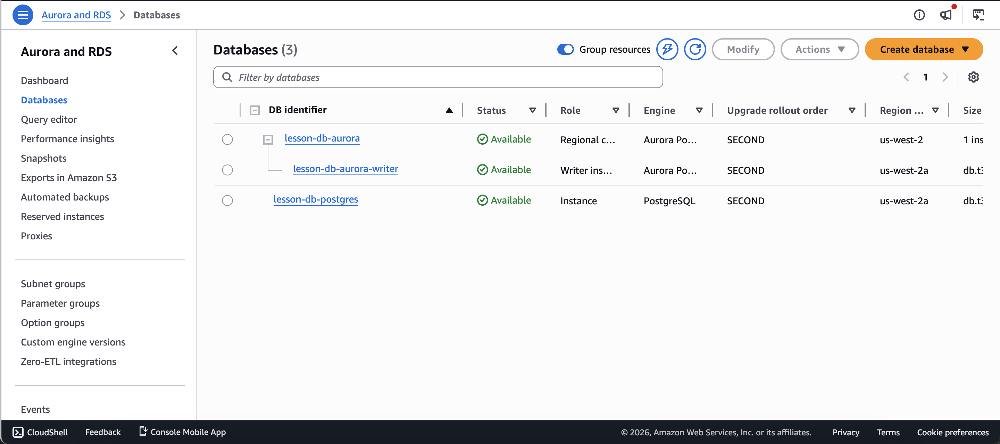
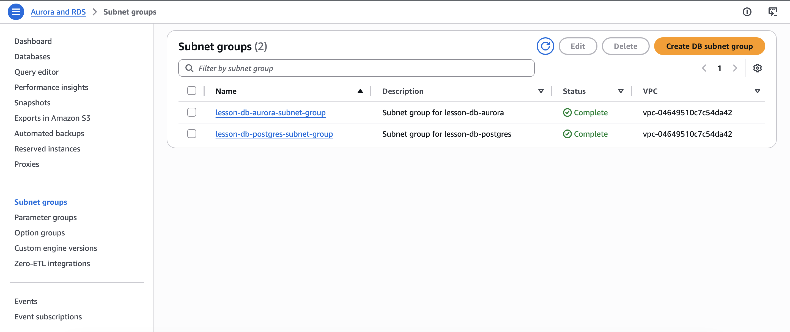
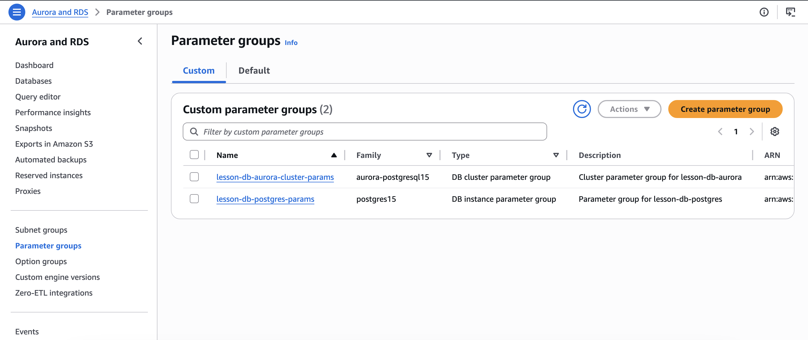
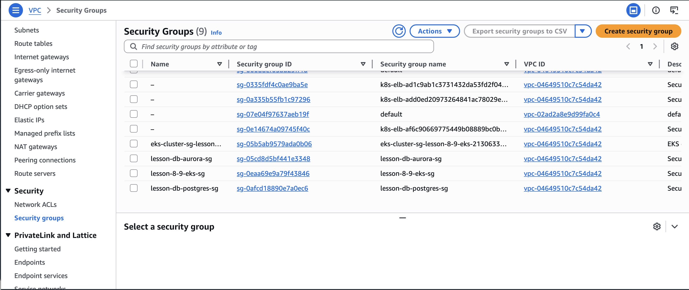

# Homework: Flexible Terraform Module for Databases

## Overview

This project implements a reusable and flexible Terraform module for
deploying AWS databases.

The module supports two deployment modes:

-   Standard RDS instance (PostgreSQL / MySQL)
-   Aurora cluster (Aurora PostgreSQL / Aurora MySQL)

The behavior is controlled by a single variable:

use_aurora = true \| false

The module automatically provisions all required infrastructure
components, including networking and database configuration.

---

## Technologies Used

-   Terraform
-   AWS RDS (PostgreSQL, MySQL)
-   AWS Aurora (PostgreSQL, MySQL)
-   AWS VPC
-   AWS EKS
-   AWS ECR
-   Jenkins
-   ArgoCD
-   Helm

---

## Project Structure

```
.
├── backend.tf
├── charts
│   └── django-app
│       ├── Chart.yaml
│       ├── templates
│       └── values.yaml
├── main-bootstrap.tf.bak
├── main.tf
├── modules
│   ├── argo_cd
│   │   ├── charts
│   │   ├── jenkins.tf
│   │   ├── outputs.tf
│   │   ├── providers.tf
│   │   ├── values.yaml
│   │   └── variables.tf
│   ├── ecr
│   │   ├── ecr.tf
│   │   ├── outputs.tf
│   │   └── variables.tf
│   ├── eks
│   │   ├── aws_ebs_csi_driver.tf
│   │   ├── eks.tf
│   │   ├── outputs.tf
│   │   └── variables.tf
│   ├── jenkins
│   │   ├── jenkins.tf
│   │   ├── outputs.tf
│   │   ├── providers.tf
│   │   ├── values.yaml
│   │   └── variables.tf
│   ├── rds
│   │   ├── aurora.tf
│   │   ├── outputs.tf
│   │   ├── rds.tf
│   │   ├── shared.tf
│   │   └── variables.tf
│   ├── s3-backend
│   │   ├── dynamodb.tf
│   │   ├── outputs.tf
│   │   ├── s3.tf
│   │   └── variables.tf
│   └── vpc
│       ├── outputs.tf
│       ├── routes.tf
│       ├── variables.tf
│       └── vpc.tf
├── outputs.tf
├── providers.tf
├── terraform.tfstate
├── terraform.tfstate.backup
└── variables.tf
```

---

## RDS Module Features

The rds module provides:

-   Conditional creation of:
    -   aws_db_instance (RDS)
    -   aws_rds_cluster + aws_rds_cluster_instance (Aurora)
-   Automatic creation of:
    -   DB Subnet Group
    -   Security Group
    -   Parameter Group
-   Support for:
    -   PostgreSQL and MySQL
    -   Aurora PostgreSQL and Aurora MySQL
-   Configurable engine, version, instance class, and storage

---

## Example Usage

### Standard RDS (PostgreSQL)

```
module "rds_postgres" {
  source = "./modules/rds"

  identifier     = "example-postgres"
  use_aurora     = false
  engine         = "postgres"
  engine_version = "15.10"
  instance_class = "db.t3.micro"

  db_name  = "appdb"
  username = "admin"
  password = "securepassword"

  subnet_ids          = module.vpc.private_subnet_ids
  vpc_id              = module.vpc.vpc_id
  allowed_cidr_blocks = ["10.0.0.0/16"]
}
```

---

### Aurora Cluster

```
module "rds_aurora" {
  source = "./modules/rds"

  identifier     = "example-aurora"
  use_aurora     = true
  engine         = "aurora-postgresql"
  engine_version = "15.10"
  instance_class = "db.t3.medium"

  db_name  = "auroradb"
  username = "admin"
  password = "securepassword"

  subnet_ids          = module.vpc.private_subnet_ids
  vpc_id              = module.vpc.vpc_id
  allowed_cidr_blocks = ["10.0.0.0/16"]
}
```

---

## Input Variables

### Core Variables

```
  Variable         Description                          Type     Default
  ---------------- ------------------------------------ -------- -------------
  identifier       Unique database identifier           string   \-

  use_aurora       Switch between RDS and Aurora        bool     false

  engine           Database engine                      string   postgres

  engine_version   Engine version                       string   15.4

  instance_class   Instance size                        string   db.t3.micro
```

---

### Storage
```
  Variable             Description                       Type     Default
  -------------------- --------------------------------- -------- ---------
  allocated_storage    Storage size (RDS only)           number   20

  storage_type         Storage type (gp2, gp3, io1)      string   gp2
```

---

### Credentials
```
  Variable   Description         Type
  ---------- ------------------- --------
  db_name    Initial database    string
  username   DB admin username   string
  password   DB admin password   string
```
---

### Networking
```
  Variable              Description     Type
  --------------------- --------------- --------------
  subnet_ids            DB subnets      list(string)
  vpc_id                VPC ID          string
  allowed_cidr_blocks   Allowed CIDRs   list(string)
```
---

### Configuration
```
  Variable                  Description                      Type     Default
  ------------------------- -------------------------------- -------- ---------
  multi_az                  Enable Multi-AZ (RDS only)       bool     false

  backup_retention_period   Backup retention days            number   7

  port                      Database port                    number   5432
```
---

### Parameter Group Settings
```
  Variable          Description                 Default
  ----------------- --------------------------- ---------
  max_connections   Max DB connections          100
  log_statement     SQL logging level           none
  work_mem          Memory per operation (KB)   4096
```
---

## How to Change Database Configuration

### Switch Between RDS and Aurora

```
use_aurora = false
use_aurora = true
```

---

### Change Database Engine

```
engine = "postgres"
engine = "mysql"
engine = "aurora-postgresql"
engine = "aurora-mysql"
```

---

### Change Instance Size

```
instance_class = "db.t3.micro"
instance_class = "db.t3.medium"
instance_class = "db.r6g.large"
```

---

### Change Engine Version

```
engine_version = "15.10"
```

---

## Outputs

-   db_endpoint
-   db_port
-   db_type
-   security_group_id
-   subnet_group_name

---

## Notes

-   Aurora consists of:
    -   Cluster (control layer)
    -   Instance (compute layer)
-   Always connect using the cluster endpoint
-   Terraform changes are applied only via:

terraform apply

---

## Conclusion

This module demonstrates a reusable and production-style approach to
managing AWS databases with Terraform.

## Screenshots

### 1. Databases Overview (RDS + Aurora)

Shows both deployment modes:
- Standard RDS instance (PostgreSQL)
- Aurora cluster with writer instance



---

### 2. DB Subnet Groups

Each database type has its own subnet group:
- Aurora subnet group
- RDS subnet group



---

### 3. Parameter Groups

Custom parameter groups created automatically:
- Cluster parameter group (Aurora)
- Instance parameter group (RDS)



---

### 4. Security Groups

Security groups created for database access:
- Aurora security group
- RDS security group

