# Final Project — DevOps Infrastructure on AWS

## Overview

This project demonstrates a complete DevOps pipeline for deploying a Django application on AWS using modern infrastructure and automation tools. The infrastructure is provisioned with Terraform, containerization is handled via Docker, and deployment is managed through Kubernetes (EKS), Jenkins (CI), and Argo CD (CD with GitOps approach).

---

## Technology Stack

- **Cloud Provider:** AWS (EKS, RDS, ECR, S3, DynamoDB)
- **Infrastructure as Code:** Terraform
- **Containerization:** Docker
- **Orchestration:** Kubernetes (EKS)
- **CI/CD:**
  - Jenkins (CI)
  - Argo CD (CD / GitOps)
- **Monitoring:**
  - Prometheus
  - Grafana
- **Package Manager:** Helm
- **Application:** Django (Python)

---

## Project Structure

```
.
├── Project/
│   ├── Django/
│   │   ├── Dockerfile
│   │   ├── Jenkinsfile
│   │   ├── docker-compose.yaml
│   │   └── app/
│   │
│   ├── charts/
│   │   └── django-app/
│   │
│   ├── modules/
│   │   ├── vpc/
│   │   ├── eks/
│   │   ├── ecr/
│   │   ├── rds/
│   │   ├── jenkins/
│   │   ├── monitoring/
│   │   ├── argo_cd/
│   │   └── s3-backend/
│   │
│   ├── main.tf
│   ├── variables.tf
│   ├── outputs.tf
│   ├── providers.tf
│   ├── backend.tf
│   └── bootstrap.tf
│
├── screenshots/
│   ├── App-browser.png
│   ├── App-browser-health.png
│   ├── EKS-cluster.png
│   ├── Node-group.png
│   ├── Load-balancer.png
│   ├── RDS.png
│   ├── ECR.png
│   ├── jenkins-login.png
│   ├── jenkins-app.png
│   ├── ArgoCD-login.png
│   ├── ArgoCD-app.png
│   ├── Grafana.png
│   ├── Grafana-graphs.png
│   ├── Prometheus.png
│   ├── Prometheus-graph.png
│   ├── Prometheus-cpu-graph.png
│   ├── kubectl-get-nodes.png
│   ├── kubectl-django-app.png
│   └── CI-CD-workflow-diagram.png
│
├── README.md
└── .gitignore
```

---

## Deployment Stages

### 1. Environment Preparation

- Initialize Terraform
- Verify variables and configuration

```bash
terraform init -backend=false
terraform validate
```

---

### 2. Backend Setup (S3 + DynamoDB)

Deploy backend resources for Terraform state:

```bash
terraform apply
```

After that, enable backend:

```bash
terraform init
```

---

### 3. Infrastructure Deployment

Deploy full infrastructure:

```bash
terraform apply
```

This will create:

- VPC and networking
- EKS cluster
- ECR repository
- RDS PostgreSQL database
- Jenkins (CI)
- Argo CD (CD)
- Monitoring stack (Prometheus + Grafana)

---

### 4. Kubernetes Resources Verification

Check deployed resources:

```bash
kubectl get all -n jenkins
kubectl get all -n argocd
kubectl get all -n monitoring
```

---

### 5. Access Verification

#### Jenkins

```bash
kubectl port-forward svc/jenkins 8080:8080 -n jenkins
```

Open: http://localhost:8080

---

#### Argo CD

```bash
kubectl port-forward svc/argocd-server 8081:443 -n argocd
```

Open: https://localhost:8081

---

### 6. Monitoring and Metrics

#### Grafana

```bash
kubectl port-forward svc/monitoring-grafana 3000:80 -n monitoring
```

Open: http://localhost:3000

- Verify dashboards
- Check metrics from Prometheus

---

## CI/CD Workflow

1. Developer pushes code to GitHub (`final-project` branch)
2. Jenkins:
   - Builds Docker image
   - Pushes image to ECR
   - Updates Helm values (image tag)
3. Argo CD:
   - Detects changes in repository
   - Automatically deploys updated application

### CI/CD workflow diagram

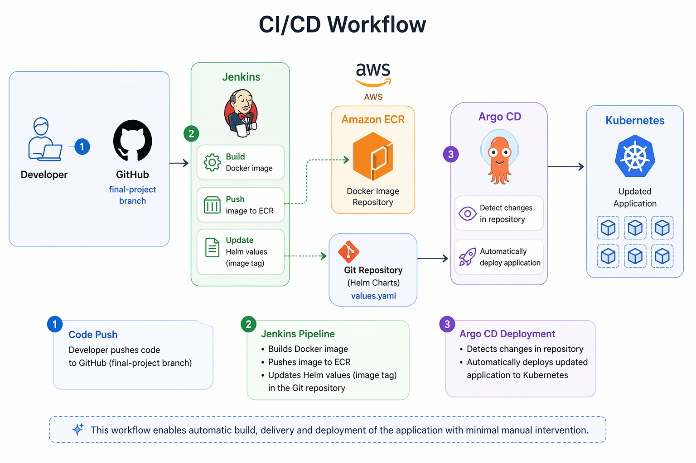

---

## Module Verification

### VPC

- Check subnets, routing, NAT, IGW

### EKS

```bash
kubectl get nodes
```

#### Cluster Nodes

Shows that the EKS cluster is running with multiple worker nodes.

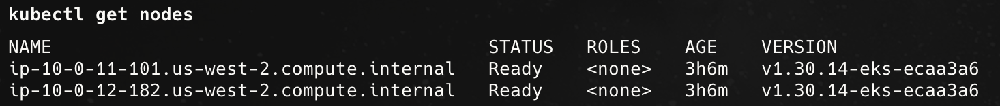

---

### ECR

- Verify repository and images in AWS Console

---

### RDS

```bash
terraform output rds_postgres_endpoint
```

---

### Jenkins

- Pipeline runs successfully
- Image pushed to ECR

---

### Argo CD

- Application status: Synced / Healthy

---

### Application Deployment (django-app)

Shows that the Django application is successfully deployed and running:
- Pods are in `Running` state
- Service is exposed via LoadBalancer
- Deployment is healthy (2/2 replicas)
- Horizontal Pod Autoscaler is configured

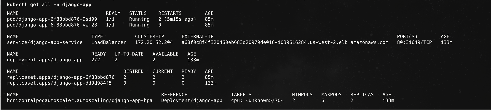

---

### Monitoring

- Prometheus targets are up
- Grafana dashboards display metrics

---

## Screenshots

### 1. AWS Infrastructure

#### EKS Cluster
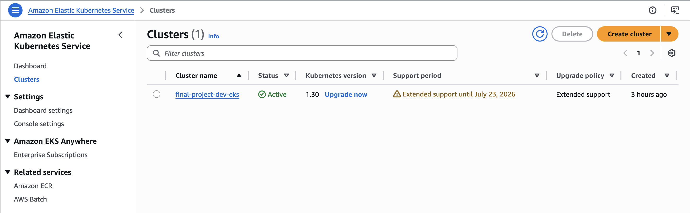

#### Node Group (2 nodes)
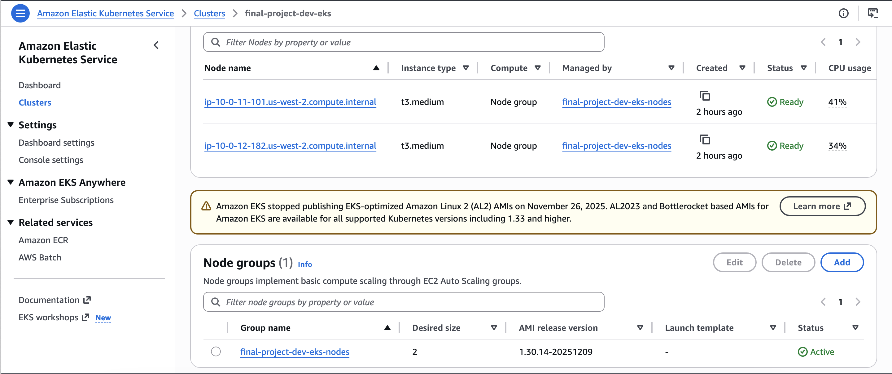

#### Load Balancer
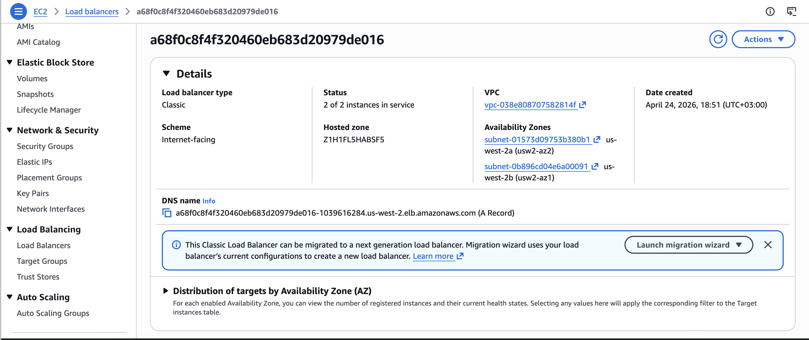

#### RDS (PostgreSQL)
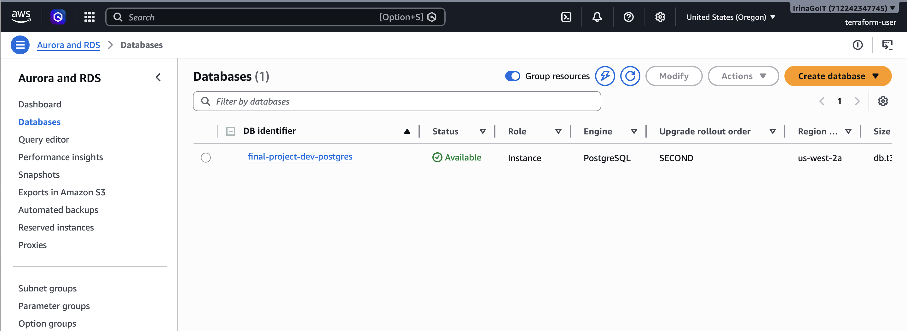

#### ECR Repository
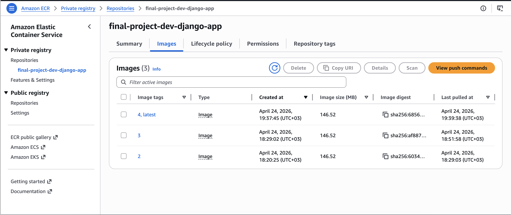

---

### 2. Application

#### Application in Browser
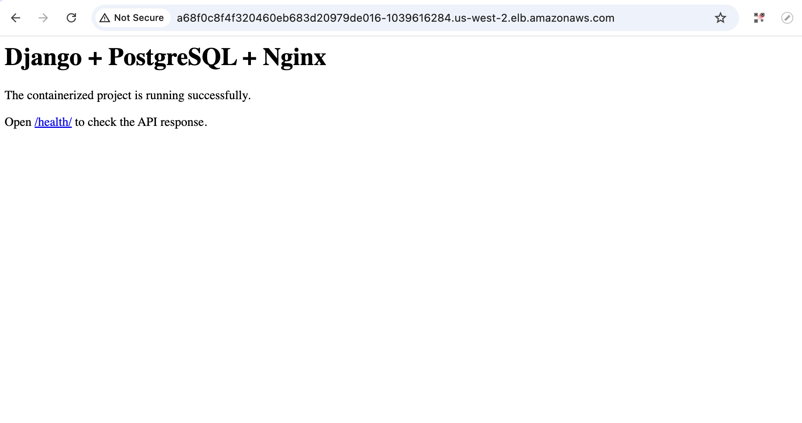

#### Health Endpoint
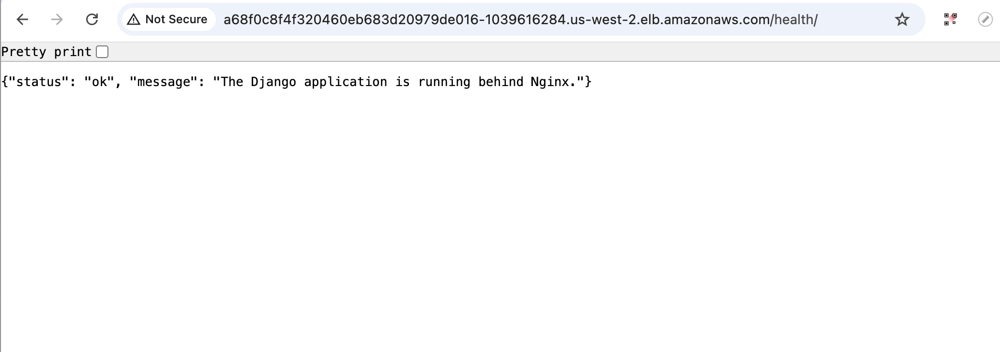

---

### 3. CI/CD and Deployment

#### ArgoCD Login


#### ArgoCD Application (Synced & Healthy)
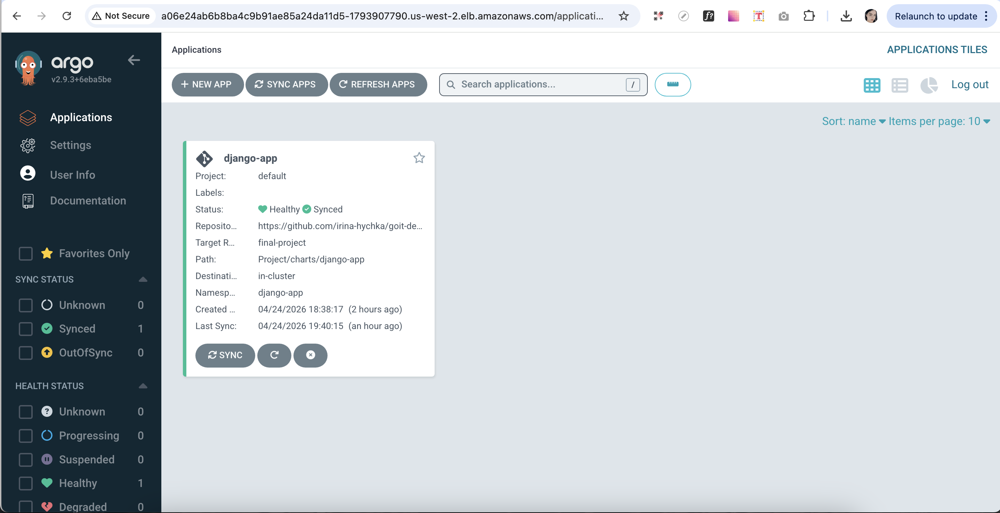

#### Jenkins Login
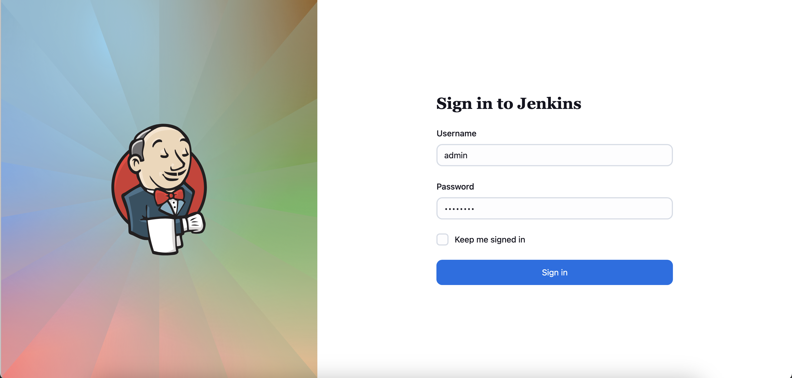

#### Jenkins Pipeline / App
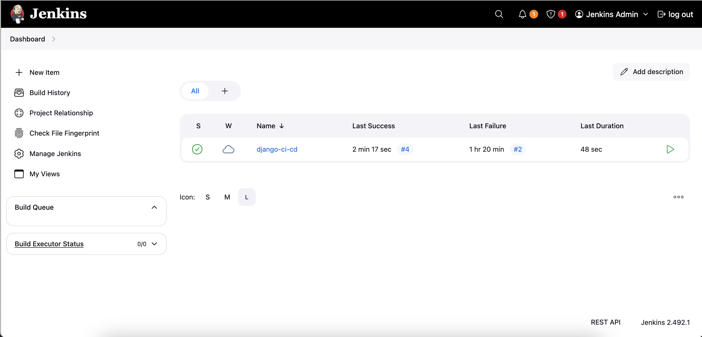

---

### 4. Monitoring

#### Prometheus UI (Query Interface)
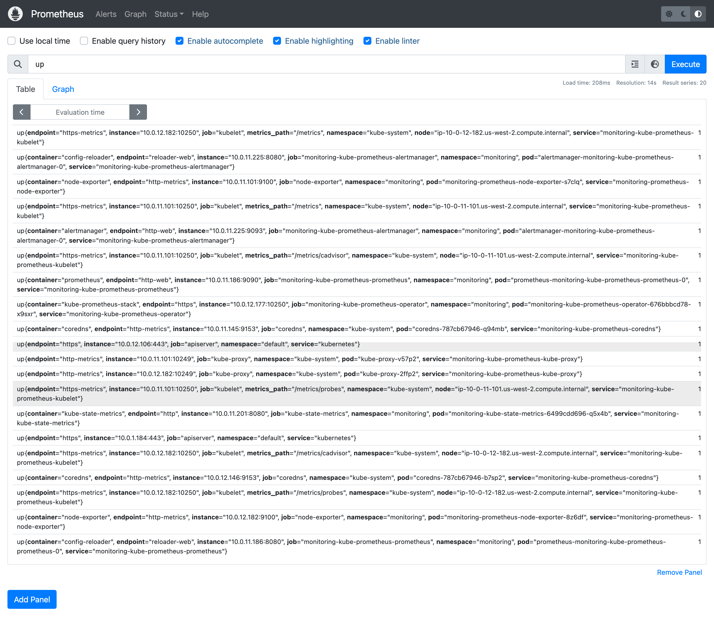

#### Prometheus Targets Status (up metric)
Shows that all monitored services are up and responding.
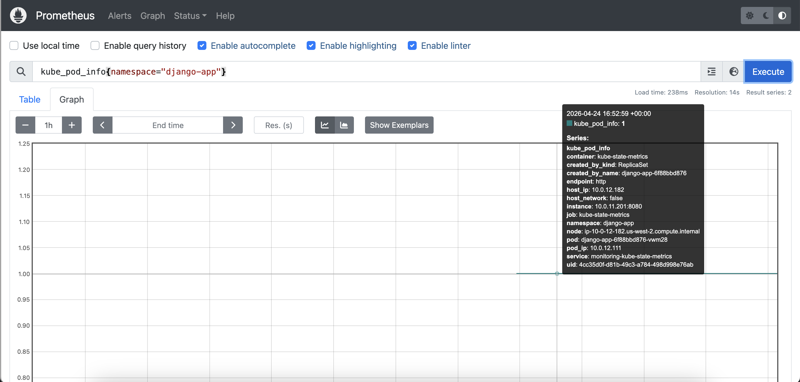

#### Prometheus Metrics (Memory Usage)
Container memory consumption across the cluster.
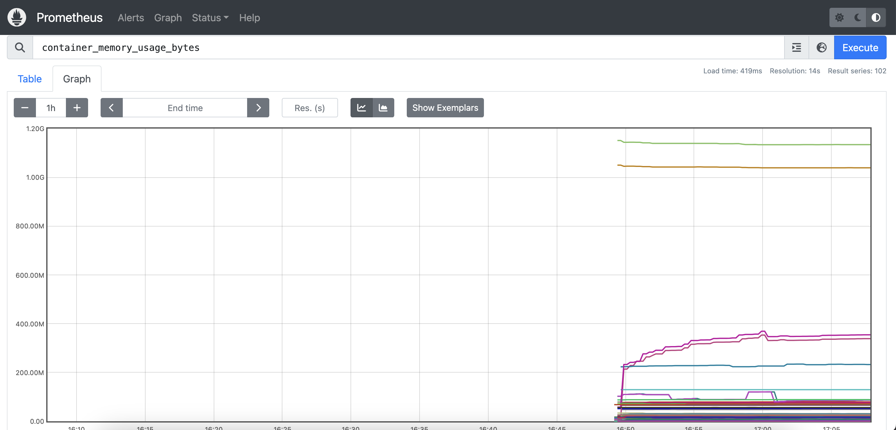

#### Grafana Dashboard
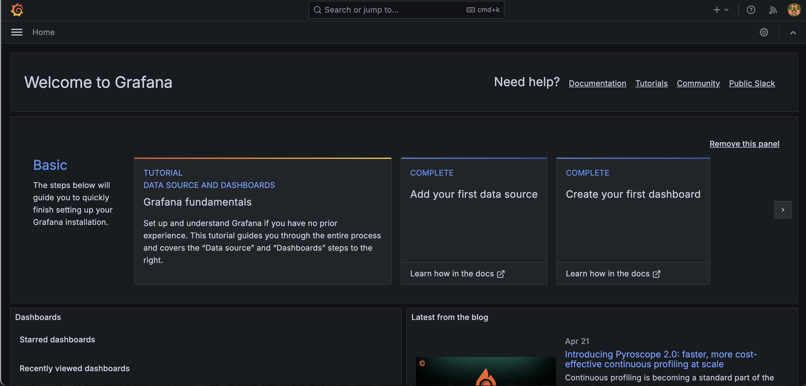

#### Grafana Metrics (CPU, Memory, Network)
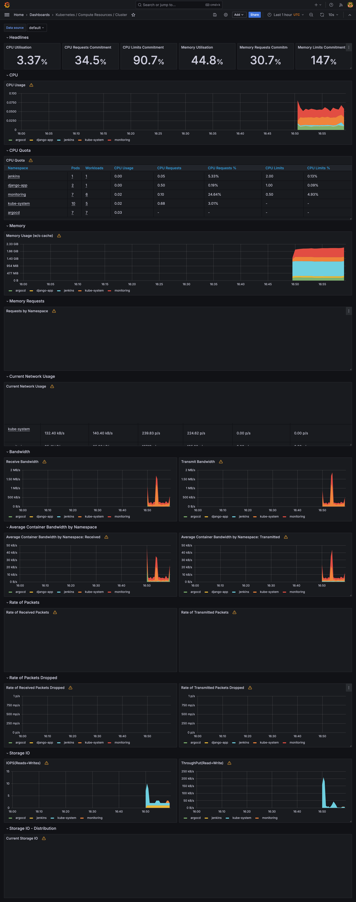

---

## Conclusion

This project demonstrates a full DevOps lifecycle:

- Infrastructure provisioning with Terraform
- Containerization with Docker
- CI/CD pipeline with Jenkins and Argo CD
- Kubernetes deployment on AWS EKS
- Monitoring with Prometheus and Grafana

The solution is scalable, automated, and follows modern DevOps best practices.
