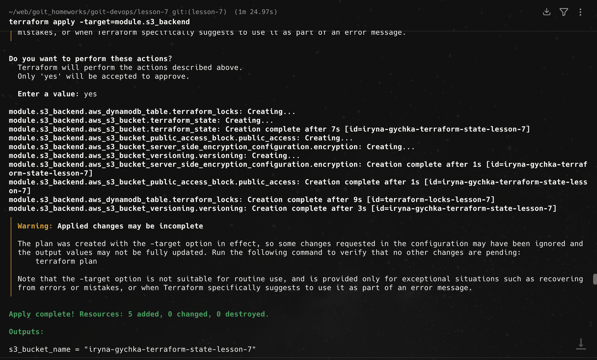
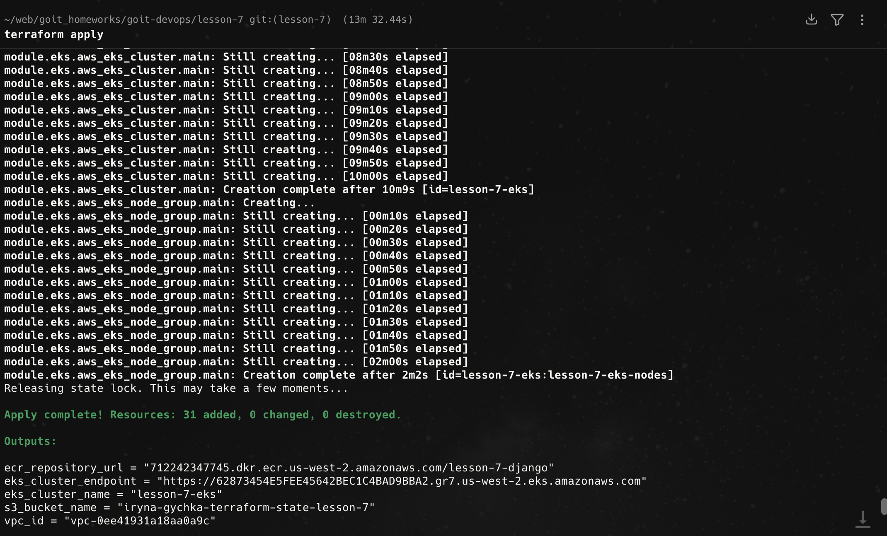
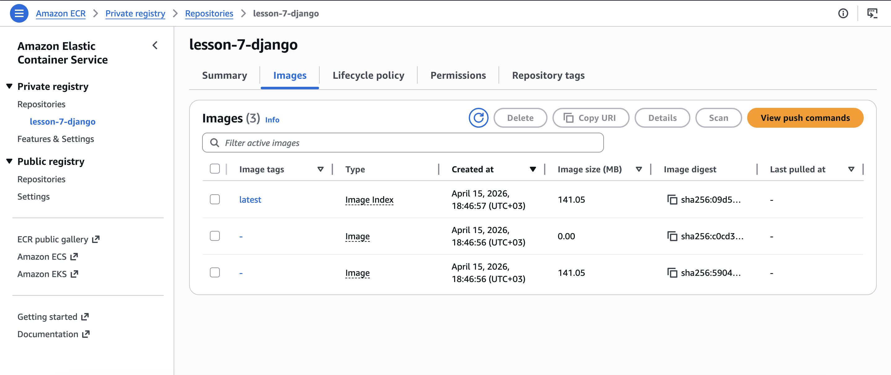
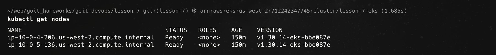
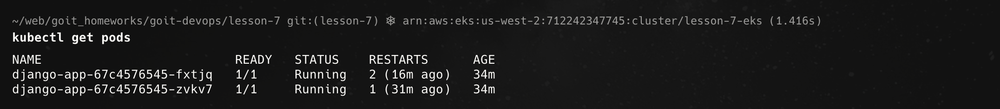
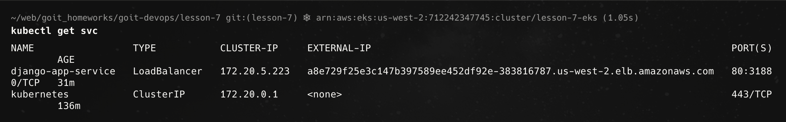
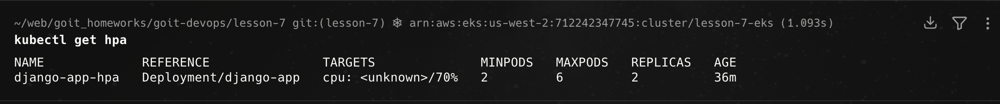
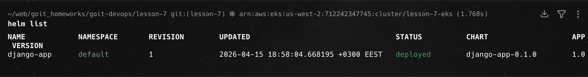
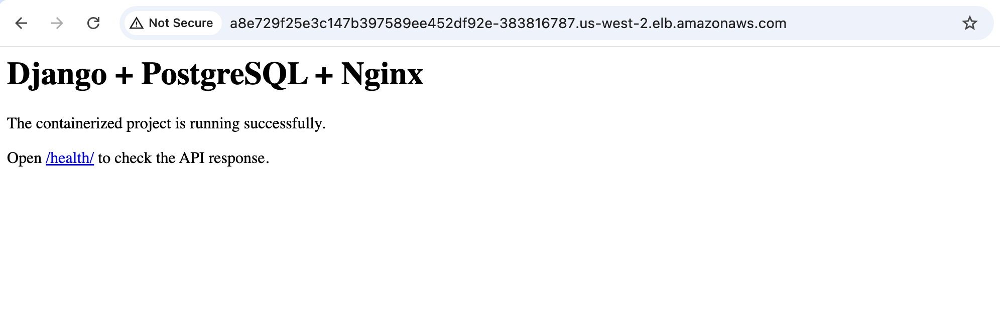
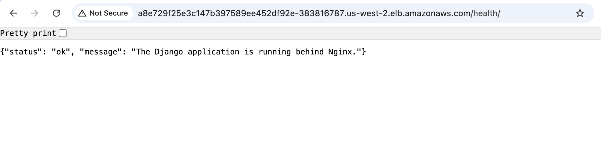

# Homework 7: Exploring Helm

## Overview

This project demonstrates the deployment of a Django application to a Kubernetes cluster using AWS services and Helm.

The infrastructure was provisioned using Terraform, and the application was containerized with Docker, stored in Amazon ECR, and deployed to Amazon EKS using a custom Helm chart.

---

## Infrastructure

The following AWS resources were created using Terraform:

- VPC with public and private subnets
- Internet Gateway
- Single NAT Gateway (cost-optimized setup)
- Amazon ECR repository for Docker images
- Amazon EKS cluster
- S3 bucket for Terraform state
- DynamoDB table for state locking

---

## Project structure

```text
lesson-7/
├── main.tf                  # Main file for connecting all modules
├── backend.tf               # Remote backend (S3 + DynamoDB)
├── outputs.tf               # Outputs: VPC ID, ECR URL, EKS endpoint
├── .gitignore
├── README.md
│
├── modules/
│   ├── s3-backend/          # S3 bucket + DynamoDB for Terraform state
│   │   ├── s3.tf
│   │   ├── dynamodb.tf
│   │   ├── variables.tf
│   │   └── outputs.tf
│   │
│   ├── vpc/                 # VPC, public/private subnets, IGW, NAT Gateway
│   │   ├── vpc.tf
│   │   ├── routes.tf
│   │   ├── variables.tf
│   │   └── outputs.tf
│   │
│   ├── ecr/                 # ECR repository with lifecycle policy
│   │   ├── ecr.tf
│   │   ├── variables.tf
│   │   └── outputs.tf
│   │
│   └── eks/                 # EKS cluster, node group, and IAM roles
│       ├── eks.tf
│       ├── variables.tf
│       └── outputs.tf
│
└── charts/
    └── django-app/
        ├── Chart.yaml
        ├── values.yaml
        └── templates/
            ├── deployment.yaml   # Django Deployment with envFrom -> ConfigMap
            ├── service.yaml      # LoadBalancer Service
            ├── configmap.yaml    # Environment variables from topic 4
            └── hpa.yaml          # HPA: 2-6 pods when CPU > 70%
```
---

## Application Stack

The application consists of:

- **Django** — web application
- **Gunicorn** — application server
- **Docker** — containerization
- **Amazon ECR** — image storage
- **Amazon EKS** — Kubernetes cluster
- **Helm** — deployment tool

---

## Terraform Usage

Initialize Terraform:

terraform init

Create backend resources (S3 + DynamoDB):

terraform apply -target=module.s3_backend

Migrate state to S3:

terraform init -migrate-state

Deploy full infrastructure:

terraform apply

---

## Docker Image

The Docker image was built and pushed to ECR:

```bash
docker buildx build --platform linux/amd64 -t lesson-7-django:latest .
docker tag lesson-7-django:latest <ECR_REPOSITORY_URL>:latest
docker push <ECR_REPOSITORY_URL>:latest
```

## Kubernetes Deployment (Helm)

The application was deployed to the Kubernetes cluster using a custom Helm chart.

The chart is located in:

* lesson-7/charts/django-app

### Deploy the application

helm install django-app charts/django-app

---

## Helm Chart Components

The Helm chart includes the following resources:

### Deployment

- Uses the Django Docker image stored in Amazon ECR
- Runs multiple replicas of the application
- Environment variables are injected via ConfigMap
- Includes readiness and liveness probes to monitor container health

### Service

- Type: LoadBalancer
- Exposes the application to the internet via AWS Load Balancer
- Routes external traffic to the Django container

### ConfigMap

- Stores environment variables required by the application:
  - DJANGO_SETTINGS_MODULE
  - DEBUG
  - ALLOWED_HOSTS
  - POSTGRES_HOST
  - POSTGRES_PORT
  - POSTGRES_DB
  - POSTGRES_USER
  - POSTGRES_PASSWORD

### Horizontal Pod Autoscaler (HPA)

- Automatically scales the number of pods based on CPU usage
- Minimum replicas: 2
- Maximum replicas: 6
- Target CPU utilization: 70%

Note: The HPA resource is successfully created. CPU metrics may show as "unknown" if metrics-server is not installed, but the configuration itself is valid.

---

## Accessing the Application

After deployment, the application becomes available via AWS LoadBalancer.

To retrieve the external address:

kubectl get svc

Example output:

http://<EXTERNAL-IP>

Health check endpoint:

http://<EXTERNAL-IP>/health/

---

## Verification

Check running pods:

kubectl get pods

Check service status:

kubectl get svc

Check autoscaling configuration:

kubectl get hpa

---

## Cleanup

To avoid unnecessary AWS costs, remove all created resources:

helm uninstall django-app
terraform destroy

---

## Notes

- A single NAT Gateway was used to reduce infrastructure cost.
- The Docker image was built for linux/amd64 to ensure compatibility with EKS nodes.
- Environment variables were managed via ConfigMap, as required by the assignment.

---

## Result

- Kubernetes cluster successfully created
- Docker image stored in ECR
- Application deployed via Helm
- External access provided via LoadBalancer
- ConfigMap integrated into deployment
- HPA configured for dynamic scaling

## Screenshots

### Terraform backend setup


### Terraform infrastructure deployment


### ECR repository (Docker image)



### Kubernetes nodes


### Running pods


### Service (LoadBalancer)


### Horizontal Pod Autoscaler


### Helm release



### Application in browser


### Health check endpoint
